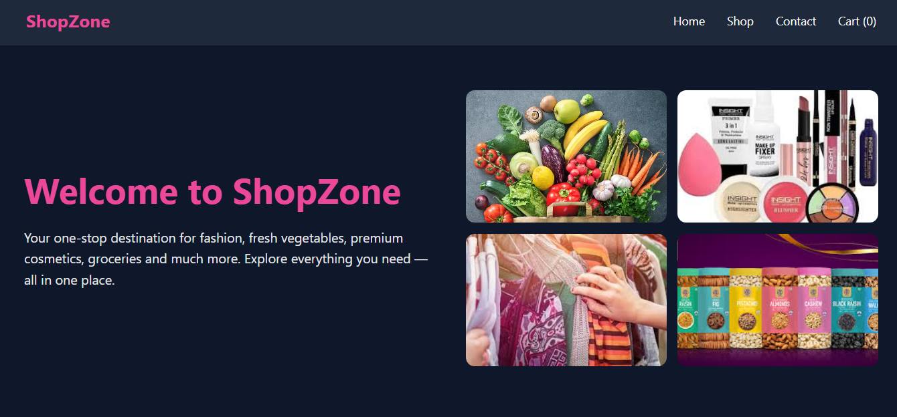
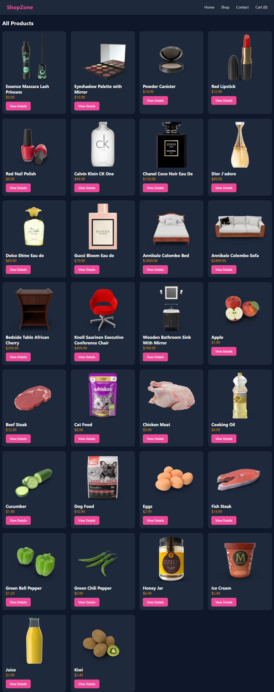
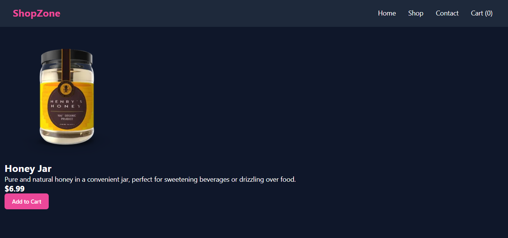
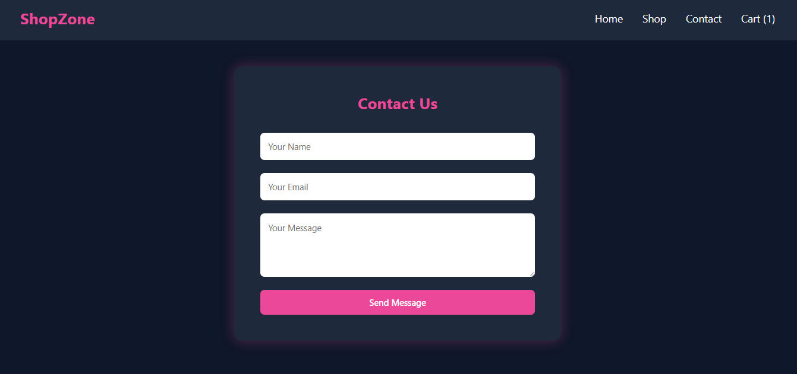
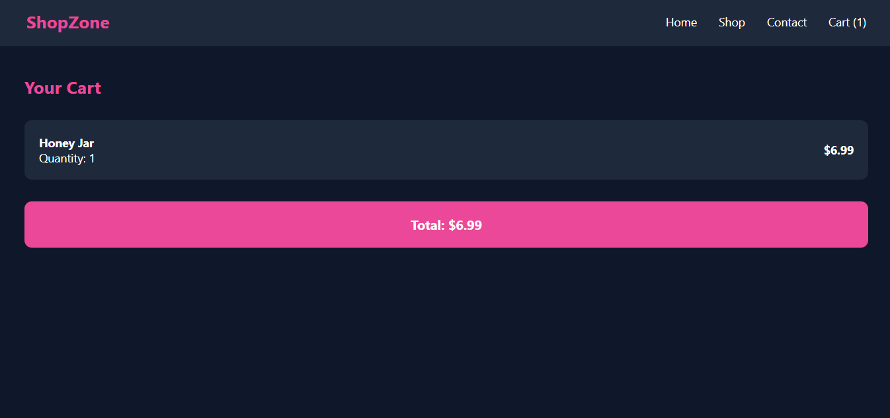

# 🛍 ShopZone – E-Commerce Single Page Application

ShopZone is a React-based E-Commerce Single Page Application built using React Router and Context API.

This project was created as part of Internship Mission 6 to understand routing, global state management, and dynamic pages in React.

---

## Features Implemented

### Level 1 (Routing & Dynamic Pages)
1. BrowserRouter setup
2. Multiple routes:
  - `/` → Home Page
  - `/shop` → Product listing
  - `/product/:id` → Dynamic product details
  - `/contact` → Contact form
  - `/cart` → Cart page
3. Used `useParams()` to fetch product based on ID
4. Used `<Link>` instead of `<a>` to prevent page reload

---

### Level 2 (Global State – Cart System)
1. Created `CartContext` using Context API
2. Wrapped entire application inside `CartProvider`
3. Add to Cart functionality
4. If product already exists → quantity increases
5. Navbar shows live cart item count
6. Cart page displays:
  - Product name
  - Quantity
  - Individual total
  - Overall total price

---

## UI Design
1. Theme: Pink + Navy + White + Soft Gold
2. Premium ecommerce style layout
3. Collage-style home page
4. Centered and styled contact form
5. Clean card-based cart layout
6. Responsive grid layout for shop page

---

## API Used
Free API:
https://dummyjson.com/products

---

## Tech Stack
1. React
2. React Router DOM
3. Context API
4. CSS (custom styling)
5. Vercel (deployment)

---

## Deployment Fix 
Added `vercel.json` file to prevent 404 error on refresh:

```json
{
  "rewrites": [
    { "source": "/(.*)", "destination": "/" }
  ]
}





